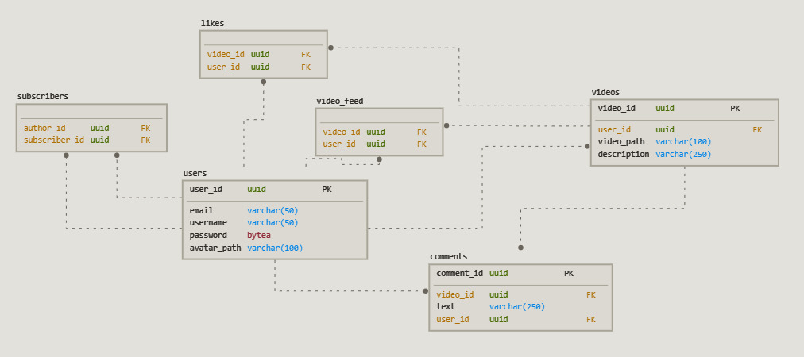

# РПЗ к курсовой работе

Нагдимаев Ильягу

## 1. Тема и целевая аудитория

<B>ТикТок</B> — сервис для создания и просмотра коротких видео, принадлежащий пекинской компании «ByteDance».

### MVP

1. Регистрация/авторизация
2. Публикация видео
3. Просмотр ленты
4. Лайки/комментарии

### Целевая аудитория

По состоянию на февраль 2021 года **MAU** =  1,2 млрд. Распределение по возрасту: 
 ([Источник](https://www.businessofapps.com/data/tik-tok-statistics/))

  **Возраст 10-19 - 32,5%**\
  **Возраст 20-29 - 29,5%**\
  **Возраст 30-39 - 16,4%**\
  **Возраст 40-49 - 13,9%**\
  **Возраст 50+ - 7,1%**

  ([Источник](https://logotip.online/blog/statistika-tiktok/))

## 2. Расчет нагрузки

**DAU** можно с уверенностью считать 50%([Источник](http://appbrain.ru/osnovnyie-metriki-effektivnosti-mobilnoy-reklamyi/)) от **MAU**. Таким образом **DAU** = 1200 * 0.5 = 600 млн. человек.

Среднее время пользования приложением за день(информация за конец 2021 год) = 80 мин. ([Источник](https://www.theverge.com/interface/2020/6/10/21285309/tiktok-2020-user-numbers-revenue-smash-hit-mea-culpa))

Для получения данных о количестве запросов, я потратил 10 минут в приложении и собрал статистику о работе приложения(.har файл).

За 10 минут было отправлено **1416** запросов(118 МБ): 46 за видео(90 МБ), 438 за статиткой(15 МБ), 489 за бизнес-логикой(5,5 МБ).

Таким образом среднее количество запросов в секунду равно:

```
1416 / (10 * 60) * 600 000 000 / (24 * 60 * 60) = 16389 RPS
```

На одного пользователя потребляется (118 * 8) / (10 * 60) = **1,58** Мбит/с 

Нагрузка пользователя в секунду | Сеть 
---                             | ---
Видео                           | (90 * 8) / (10 * 60) = **1,2** Мбит / с 
Статика                         | (11,3 * 8) / (10 * 60) = **0,2** Мбит / с 
Бизнес-логика                   | (3,8 * 8) / (10 * 60) = **0,05** Мбит / с
Итого: **1,45** Мбит / с

Нагрузка пользователя в день    | Сеть 
---                             | ---
Видео                           | 1,2 * 40 * 60 = **2800** Мбит
Статика                         | 0,2 * 40 * 60 = **480** Мбит
Бизнес-логика                   | 0,05 * 40 * 60 = **120** Мбит
Итого: **3400** Мбит

Нагрузка дневной аудитории      | Сеть 
---                             | ---
Видео                           | (2800 * 500 000 000) / (24 * 60 * 60) = **15823** Гбит
Статика                         | (480 * 500 000 000) / (24 * 60 * 60) = **2712** Гбит
Бизнес-логика                   | (120 * 500 000 000) / (24 * 60 * 60) = **678** Гбит
Итого: **19213** Гбит

### Расчет загружаемых видео

Средний размер видео = 90 МБ / 33 = 1,96 МБайт. За месяц пользователи загружают 58 млн видео([Источник](https://www.businessofapps.com/data/tik-tok-statistics/)). Таким образом за один месяц пользователи загрузят видео на 1,96 МБ * 58 млн = 108,41 ТБайт.

## 3. Логическая схема бд

