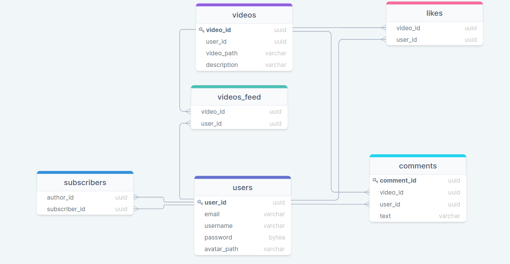
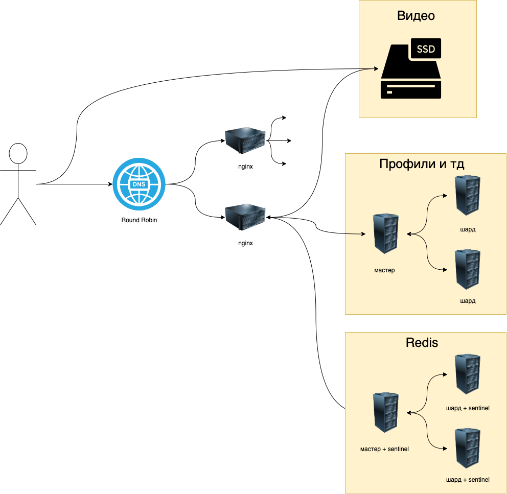

# РПЗ к курсовой работе

Нагдимаев Ильягу

## 1. Тема и целевая аудитория

<B>ТикТок</B> — сервис для создания и просмотра коротких видео, принадлежащий пекинской компании «ByteDance».

### MVP

1. Регистрация/авторизация
2. Публикация видео
3. Просмотр ленты
4. Лайки/комментарии

### Целевая аудитория

По состоянию на февраль 2021 года **MAU** =  1,2 млрд. Распределение по возрасту: 
 ([Источник](https://www.businessofapps.com/data/tik-tok-statistics/))

  **Возраст 10-19 - 32,5%**\
  **Возраст 20-29 - 29,5%**\
  **Возраст 30-39 - 16,4%**\
  **Возраст 40-49 - 13,9%**\
  **Возраст 50+ - 7,1%**

  ([Источник](https://logotip.online/blog/statistika-tiktok/))

## 2. Расчет нагрузки

**DAU** можно с уверенностью считать 50%([Источник](http://appbrain.ru/osnovnyie-metriki-effektivnosti-mobilnoy-reklamyi/)) от **MAU**. Таким образом **DAU** = 1200 * 0.5 = 600 млн. человек.

Среднее время пользования приложением за день(информация за конец 2021 год) = 80 мин. ([Источник](https://www.theverge.com/interface/2020/6/10/21285309/tiktok-2020-user-numbers-revenue-smash-hit-mea-culpa))

Для получения данных о количестве запросов, я потратил 10 минут в приложении и собрал статистику о работе приложения(.har файл).

За 10 минут было отправлено **1416** запросов(118 МБ): 46 за видео(90 МБ), 438 за статиткой(15 МБ), 489 за бизнес-логикой(5,5 МБ).

Таким образом среднее количество запросов в секунду равно:

```
1416 / (10 * 60) * 600 000 000 / (24 * 60 * 60) = 16389 RPS
```

На одного пользователя потребляется (118 * 8) / (10 * 60) = **1,58** Мбит/с 

Нагрузка пользователя в секунду | Сеть 
---                             | ---
Видео                           | (90 * 8) / (10 * 60) = **1,2** Мбит / с 
Статика                         | (11,3 * 8) / (10 * 60) = **0,2** Мбит / с 
Бизнес-логика                   | (3,8 * 8) / (10 * 60) = **0,05** Мбит / с
Итого: **1,45** Мбит / с

Нагрузка пользователя в день    | Сеть 
---                             | ---
Видео                           | 1,2 * 40 * 60 = **2800** Мбит
Статика                         | 0,2 * 40 * 60 = **480** Мбит
Бизнес-логика                   | 0,05 * 40 * 60 = **120** Мбит
Итого: **3400** Мбит

Нагрузка дневной аудитории      | Сеть 
---                             | ---
Видео                           | (2800 * 500 000 000) / (24 * 60 * 60) = **15823** Гбит
Статика                         | (480 * 500 000 000) / (24 * 60 * 60) = **2712** Гбит
Бизнес-логика                   | (120 * 500 000 000) / (24 * 60 * 60) = **678** Гбит
Итого: **19213** Гбит

### Расчет загружаемых видео

Средний размер видео = 90 МБ / 33 = 1,96 МБайт. За месяц пользователи загружают 58 млн видео([Источник](https://www.businessofapps.com/data/tik-tok-statistics/)). Таким образом за один месяц пользователи загрузят видео на 1,96 МБ * 58 млн = 108,41 ТБайт.

## 3. Логическая схема бд



## 4. Физическая схема

В качестве СУБД будем использовать PostgreSQL из-за ее производительности, распространенности, хорошой работы под высокими нагрузками. Основная нагрузка будет приходиться не на базу данных, а на каналы связи для доставки видео, поэтому смысла шардировать базу нет. Для устойчивости базы следует сделать реплики(2 штуки), они будут использоваться только для чтения.

### Расчет размера БД:

Размер uuid = 16 Байт

Размер varchar(n) = n Байт

Пароли будем хранить в зашифрованном виде, и исопльзовать рекомендации [OWASP](https://cheatsheetseries.owasp.org/cheatsheets/Password_Storage_Cheat_Sheet.html)(sha3 + bcrypt).

Размер password = 60 Байт

Размер users
```
user_id + email + username + password + avatar_path = 16 + 50 + 50 + 60 + 100 = 276 Байт
276 Байт * 600 млн ~ 154 ГБайт
```

Размер videos
```
video_id + user_id + video_path + description = 16 + 16 + 100 + 250 = 382 Байта
382 Байт * 600 млн * 12 ~ 2561 ГБайт
```

Размер likes([кол-во лайков, поставленных пользователями за месяц](https://news.cpa.ru/tiktok-showed-audience-statistics/))
```
video_id + user_id = 16 + 16 = 32 Байт
32 Байт * 1,62 млрд * 12 = 576 ГБайт (за год)
```

Размер subscribers(предположим, что каждый пользователь подписан минимум на 10 авторов)
```
author_id + subscriber_id = 16 + 16 = 32 Байт
32 Байт * 10 * 1200 млн ~  357,6 ГБайт (за все время)
```

Размер video_feed(ленту будем генерировать на 33 * 4 ~ 150 видео для каждого пользователя)
```
video_id + user_id = 16 + 16 = 32 Байт
32 Байт * 150 * 600 млн = 2682 ГБайт
```

Размер comments(предположим, что человек комментирует видео 2 раза в день)
```
comment_id + video_id + text + user_id = (16 + 16 + 250 + 16)*2 = 596 Байт
596 Байт * 365 * 600 млн ~ 1853 ГБайт = 118,7 ТБайт 
```

Итоговый размер бд за год
```
154 ГБайт + 2561 ГБайт + 576 ГБайт + 357,6 ГБайт + 2682 ГБайт + 118,7 ТБайт = 2616 ГБайт ~ 124,8 ТБайт
```

Так как основная нагрузка идет на видео контент, следует спроектировать CDN. Контент будем разделяться на "актуальный" и "неактуальный". Лента формируется "пачками" по 150 видео, на основе работы рекомендательной системы. На основе работы этой системы можно узнать "актуальный" контент и зугрузить его на сервера.

Все видео будут загружаться в хранилища, не входящие в CDN. После работы рекомендательной системы, контент будет догружаться на CDN.

Распределение "актуального" контента по CDN, будет производиться во время минимальной активности пользователей(3-6 утра по местному времени). Роутинг внутри CDN будем осущствлять с помощью GEO BASED DNS(это способствует уменьшению задержки из-за удаленности серверов от пользователя, а так же логически совпадает с тем, что в разных регионах людям будет рекомендоваться разный контент).

Расчёт конфигурации CDN сервера:

При пиковом онлайне в 10 000 000 пользователей, пропускная способность должна равняться:

```
1,58 Мбит/с * 10 000 000 = 15,8 Тбит/c
```

При использовании 2-х сетевых карт с пропускной способностью 25 Гбит/c, то потребуется:

```
16179,2 / (25 * 2) = 323 серверов
```

В месяц загружается примерно 108 ТБайт видео => в день загружается 3,6 ТБайт. Будем считать, что в "актуальное" попадает лишь 15% загруженного за день контента, а хранить его надо неделю:

```
0,15 * 3,6 ТБайт = 552.96 ГБайт ("актуального" контента в день)
```

Актуальный контент должен храниться неделю:

```
552.96 ГБайт * 7 = 3870 ГБайт = 3,78 ТБайт
```

Следовательно на CDN серверах должны стоять SSD объемом 8 ТБ.

Для хранения "неактуального" контента потребуется 91,8 ТБайт в месяц.

В год:

```
91,8 ТБайт * 12 = 1001,6 ТБайт
```

## 5. Технологии

В качестве основного языка бекенда будет использоваться Golang, тк в нем удобный параллелизм, а также он прост в освоении командой разработки. Помимо этого под Go написано большое колличество сторонних моделей. И у языка есть сформировавшиеся сообщество. Если во время эксплаутации будут выявлены самые нагруженные части проекта, то они будут переписываться на более быстрые языки такие как, например, C++. Также бекенд будет иметь микросервисную архитектуру, все сервисы будут общаться по GRPC

На фронтенде будет стандартный стек технологий HTML, CSS, JS с использованием React. Этот набор технологий наиболее популярный на рынке, поэтому для него всегда можно найти разработчиков.

В качестве основного протокла свзяи будет использоваться HTTPS. Но, в случае такой возможности, клиент будет переключаться на HTTP2, тк такой вид протокола является более актуальным и быстрым, особенно для медиафайлов.

Для обеспечения качества разработки будет использоваться GitLab CI с линтерами и юнит-тестами. На бекенде будут написаны end to end тесты, а на фронтенде основной функционал должен быть покрыть тестами на Selenium.

Раслкадка конфигов будет происходить с помощью puppet. А сам процесс довоза новых версий кода будет организован с помощью RPM-пакетов. Также в проекте будет использоваться Kubernetes.

## 5. Хостинг

Для расположения такого колличества серверов можно воспользоваться услугами компании [selectel](https://selectel.ru/), чьи дата-центры находятся в Москве и Санкт-Петербурге. Можно равномерно расположить сервера между этими ДЦ для увелечения стабильности, воспользовавшись услугой аренды серверной стойки.

## 6. Балансировка

Помимо Round Robin DNS балансировки между ДЦ с удалением неотвечающих ip с помощью скрипта. Внутри самих ДЦ трафик, не связанный с видео, балансируется с помощью балансировки L7 с использованием сети Nginx'ов. Тк он решает проблемы клиентов с медленным интернетом(60% трафика с телефонов). Помимо этого, тк весь трафик идет через https или http2, то в Nginx есть возможность быстро воспользоваться этим протоколом.

Что касается балансировки видео, то в ней load balancer(nginx), чтобы не создавать дополнительный трафик, будет перенаправлять клиента напрямую в ssd с необходимым видео, то есть будет использоваться механизм балансировки с редиректом.



Внутри кластера микросервисы будут общаться с помощью envoy.


## 7. Список серверов

Сервер                      |CPU    |RAM    |Тип диска  |Объем диска    |Кол-во серверов
---                         |---    |---    |---        |---            |---    
Nginx                       |16     |16     |           |               |50
Backend                     |16     |32     |           |               |4
PostgreSQL                  |16     |32     |SSD        |8 ТБайт        |5(1 master + 2 slaves)
CDN(актуальное хранилище)   |16     |32     |SSD        |8 ТБайт        |350
Неактуальное хранилище      |16     |16     |HDD        |128 ТБайт      |1